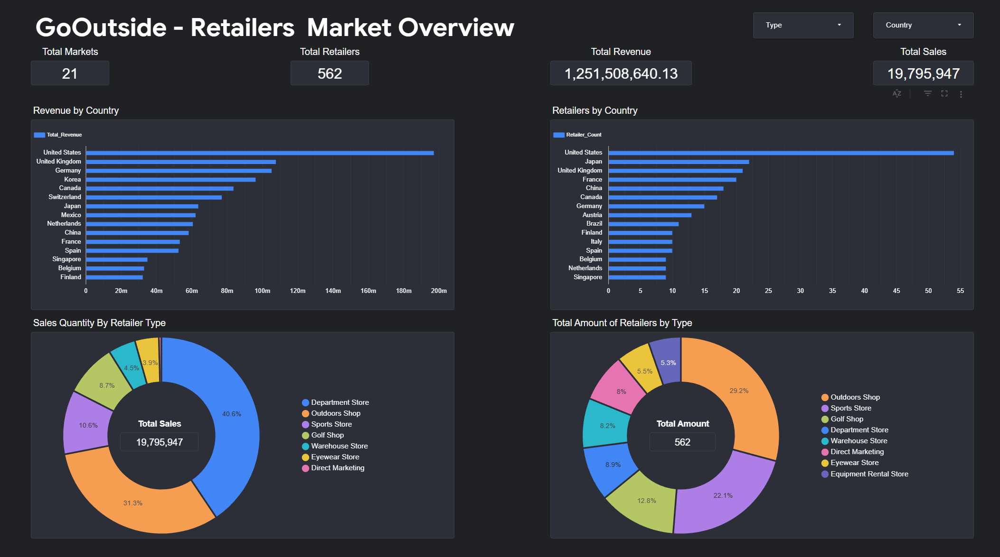
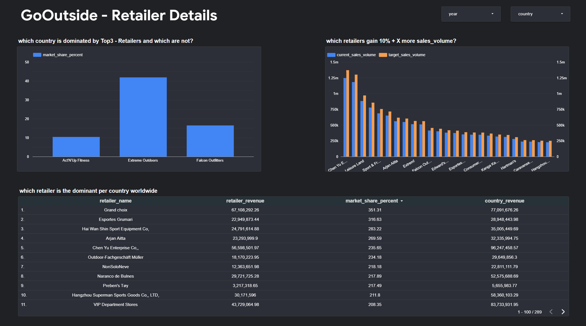
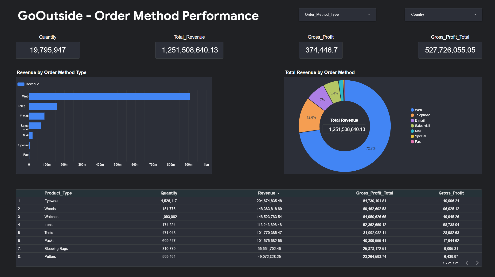
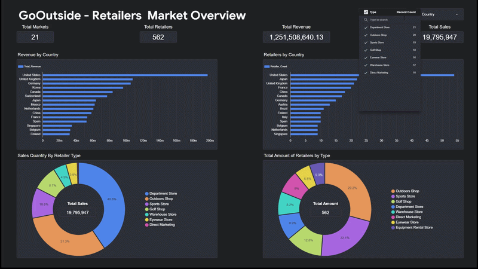
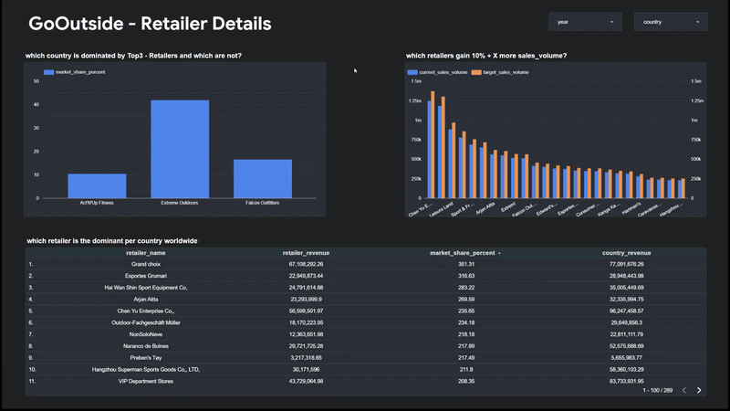
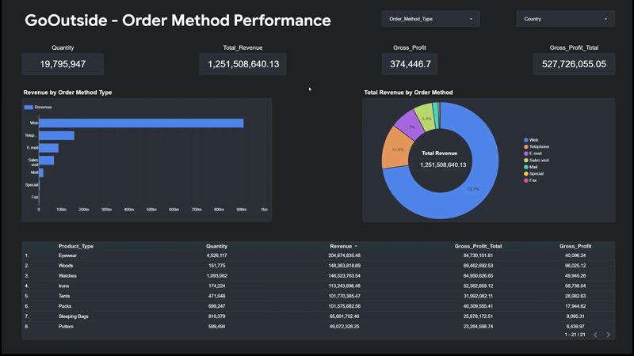

# GoOutside's Retail and Sales Performance Analytics

A business intelligence project transforming retail sales and product data into actionable insights to support market growth, retailer strategy, and financial performance at GoOutside.

---

## Overview

The objective of this project was to turn GoOutside's sales and product data into meaningful business insights for two key stakeholders:

* **Dustin: Head of Retail Partnerships:** Understand market composition, retailer distribution, market concentration, and opportunities for growth.
* **Sarah: Finance Manager:** Evaluate revenue, gross profit, order-method performance, and product profitability.

Using **Google BigQuery** for data querying and transformation and **Looker Studio** for data visualisation, I developed a three-page interactive dashboard tailored to each stakeholder's needs.

The project follows the complete analytics workflow, from querying relational datasets to building visual reports that support business decision-making.

## Dashboard Preview

### Page 1 — Retail Market Overview

**Stakeholder:** Dustin · Head of Retail Partnerships

Provides an overview of the markets GoOutside operates in, including retailer distribution, sales volume, and revenue by country and retailer type.



**Key business questions**

* Which countries generate the most revenue?
* How are retailers distributed across markets?
* Which retailer types contribute the most sales volume?
* How does the retailer vary across the different types?

### Page 2 — Retailer & Market Opportunities

**Stakeholder:** Dustin · Head of Retail Partnerships

Focuses on retailer market share and market concentration to help identify where GoOutside could prioritise retailer growth or acquisition.



**Key business questions**

* Which retailers account for the largest share of revenue within each market?
* Are markets concentrated among a few large retailers or distributed across many retailers?
* Where could GoOutside prioritise its retail partnership strategy?


### Page 3 — Order & Financial Performance

**Stakeholder:** Sarah · Finance Manager

Examines revenue and gross profit across order methods and product categories, helping identify the strongest contributors to financial performance.



**Key business questions**

* Which order methods generate the most revenue?
* Which methods contribute the most gross profit?
* Which product categories perform best financially?

---

## Interactive Dashboard

The dashboards include interactive controls that allow users to explore the data, filter results, and investigate different markets and performance measures.

### Exploring the Market Overview



### Exploring Retailer Opportunities



### Exploring Financial Performance



---

## Technical Approach

### 1. Data Exploration

Used Google BigQuery to explore the available datasets and understand the relationships between retailers, sales, products, and order methods.

**Datasets used**

* `retailers` — retailer identifiers, retailer types, and countries.
* `daily_sales` — quantities, prices, costs, product identifiers, and order-method codes.
* `products` — product categories, unit prices, and unit costs.
* `methods` — order-method identifiers and descriptions.

### 2. SQL Transformation & Analysis

Developed SQL queries to aggregate and analyse the data at different levels of detail.

The analysis included:

* Joining relational datasets using shared identifiers.
* Aggregating sales quantities and revenue.
* Calculating gross profit.
* Calculating retailer revenue and market share.
* Ranking retailers within each country.
* Measuring revenue concentration among the top three retailers.
* Comparing revenue and profitability across order methods and product categories.
* Validating retailer identifiers to check for duplicate records that could inflate results.


### 3. Data Validation

Checked retailer identifiers for duplicates before joining the retailer and sales datasets.

This helped verify whether repeated retailer records could cause sales quantities or revenue to be counted multiple times.

Also considered the distinction between units sold and unique orders: because the available fields did not include a confirmed order identifier, quantity was treated as sales volume rather than order count.

### 4. Dashboard Development

Connected the analytical data in BigQuery to Looker Studio and designed three dashboard pages around the requirements of the two stakeholders.

The visualisations included:

* KPI summaries.
* Bar charts for country, retailer and order-method.
* Market-share and concentration analysis.
* Tables for detailed performance comparisons.
* Interactive filters for exploring the data.

---

## Tools & Technologies

| Tool                | Purpose                                                                     |
| ------------------- | --------------------------------------------------------------------------- |
| **Google BigQuery** | Data exploration, querying, and transformation                              |
| **SQL**             | Joins, aggregations, calculated metrics, ranking, and market-share analysis |
| **Looker Studio**   | Interactive dashboards and visual reporting                                 |
| **Google Sheets**   | Data exploration and first analysis with pivot tables                       |


## Project Outcome

The final deliverable is a three-page interactive business intelligence dashboard that connects technical data analysis with practical business questions.

By separating the reporting into retailer market overview, retailer details, and order methaods performance, the project provides Dustin and Sarah with views tailored to their respective responsibilities.

**The main objective was not simply to visualise data, but to make it easier to explore business performance and identify where further action may be needed.**

## Project Structure

```text
GoOutside-Retail-and-Sales-Performance-Analytics/
│
├── README.md
│
├── dashboard/
│   ├── 01_retailers_market_overview.png
│   ├── 02_retailer_details.png
│   └── 03_order_method_performance.png
│
├──gifs/
│  ├── 01_market-overview-interactive.gif
│  ├── 02_retailer-details-interactive.gif
│  └── 03_order-method-performance-interactive.gif
│
└── sql/
    ├── 01_market_overview.sql
    ├── 02_retailer_market_share.sql
    ├── 03_market_concentration.sql
    ├── 04_retailer_analysis.sql                         
    └── 05_order_method_analysis.sql

```

## My Contributions

This was a collaborative group project developed to analyze GoOutside’s retail market and financial performance.

My primary contributions were:

* **Page 1: Market Overview:** Developed the market overview dashboard and its supporting analysis.
* **Page 3: Financial Performance:** Developed the financial performance dashboard, focusing on sales revenue and profitability.

**Page 2: Market Opportunities** was primarily developed by my group partner.

The final project combines our contributions into a unified dashboard to support data-driven business decisions.


---
